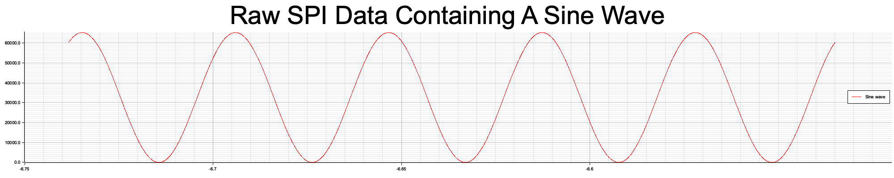
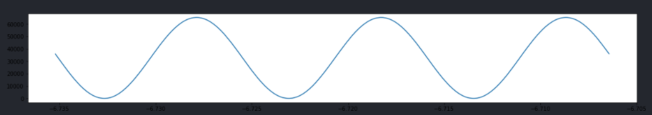

# Interpret SPI Data in Rust

This repo is a quick exercise to see if I could accomplish the same data processing and results as I do in python with pandas. 

The final result is that it took about 10x as many lines of code to accomplish the same thing in rust as I did in python but they each took about the same amount of actual time to write. 

The plotting in rust is workable but definitely not as streamlined as matplotlib and the final graph wasn't as smooth.

The source code for the python pandas code in in src/interpret.rs

The plot in rust

Vs. the plot with matplotlib

